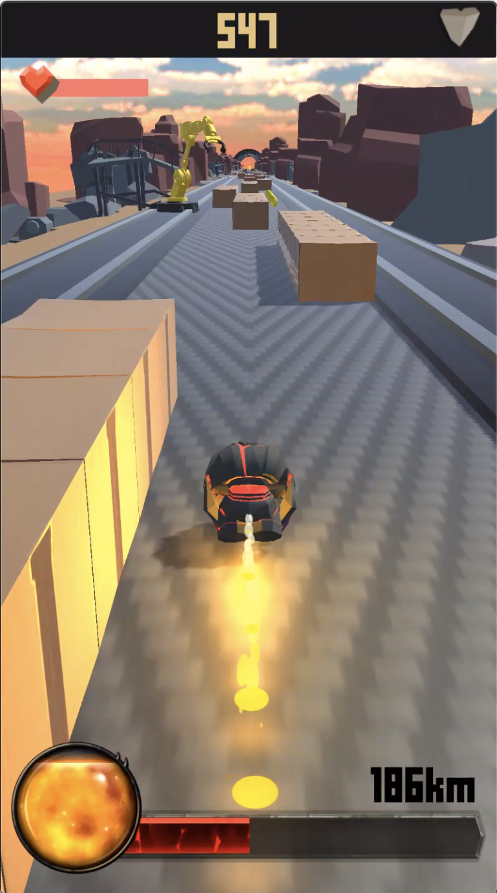

# Bumpermon
Save the toy from the melting furnace!

Enjoy endless running game with various characters and items!

We originally devleoped this project using Unity3D by private repository, but we decided to open our sources for good reasons.

Bumpermon is currently not available in mobile application store :)

## Game Introduce

### Screenshots
  

Teaser Video : https://www.youtube.com/watch?v=w1iPs7SvL8E

Launch Video : https://www.youtube.com/watch?v=1Rz1UVz68Qg

## Development
Because we developed defense game called 'GG told me' by using Unity engine, we decided to use unity engine in this game.

Unity ver : 2018.1.02f

We co-developed critical area like character movement, map and obstacle generation.

We divides the role UI, camera, sound and effect areas. Also, we discuss character and item design with our artist.

Several technics are used in this game. Camera movement and making launch video by using timeline functions are representitive of that.

|||
|------|------|
|Before Boost|After Boost|

### License
If you interest about this game and the concept, you can always contact to us.
